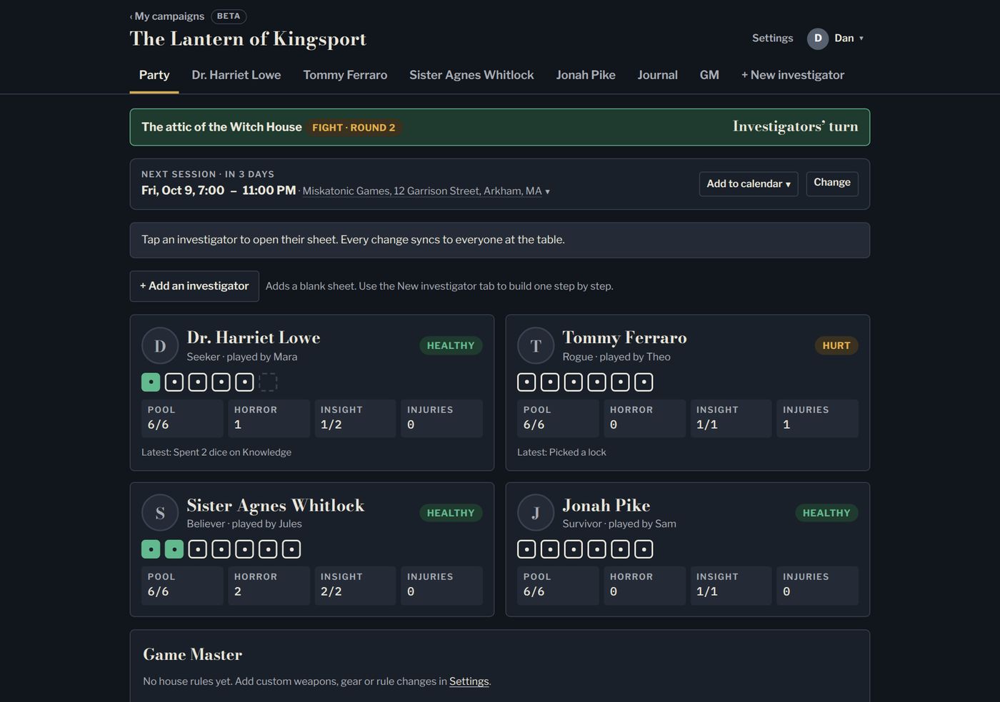
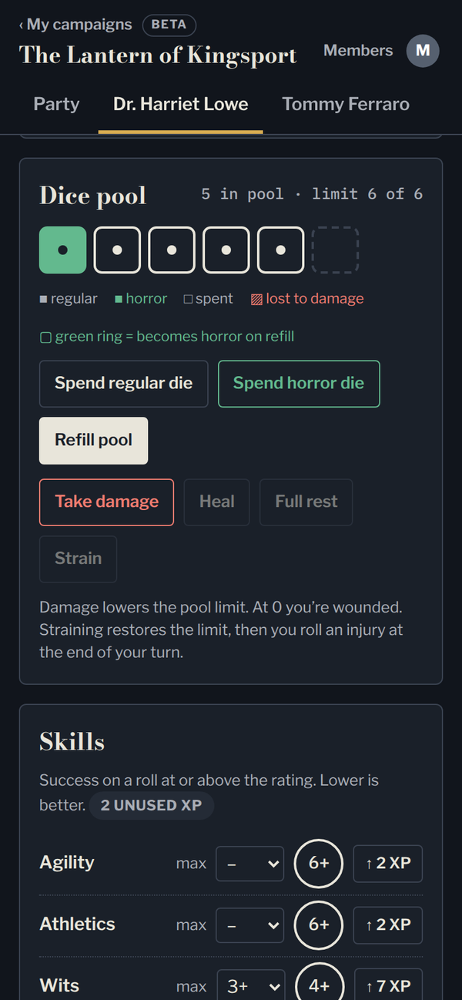
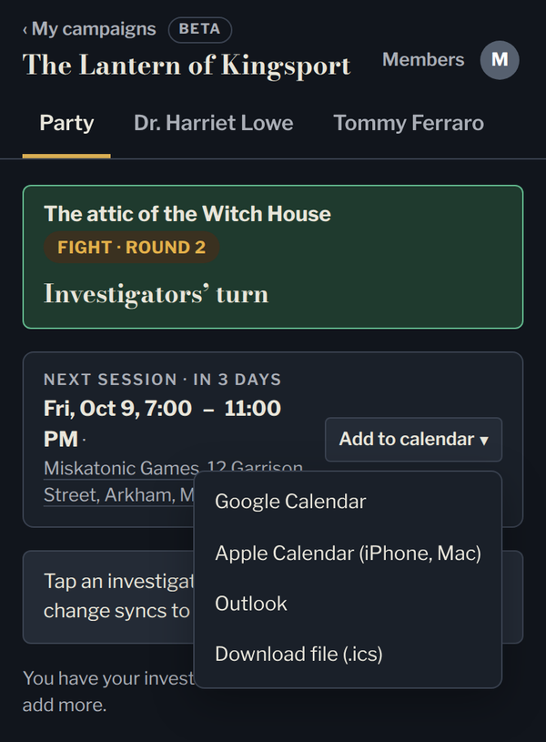
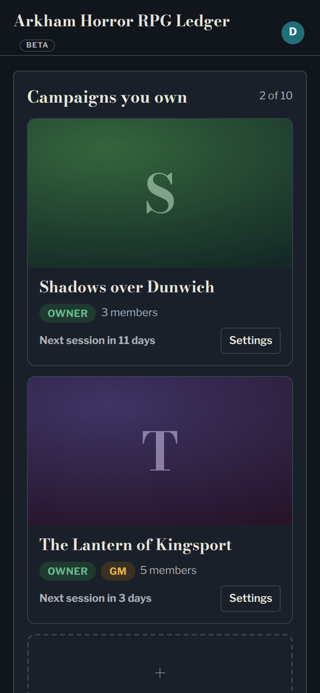
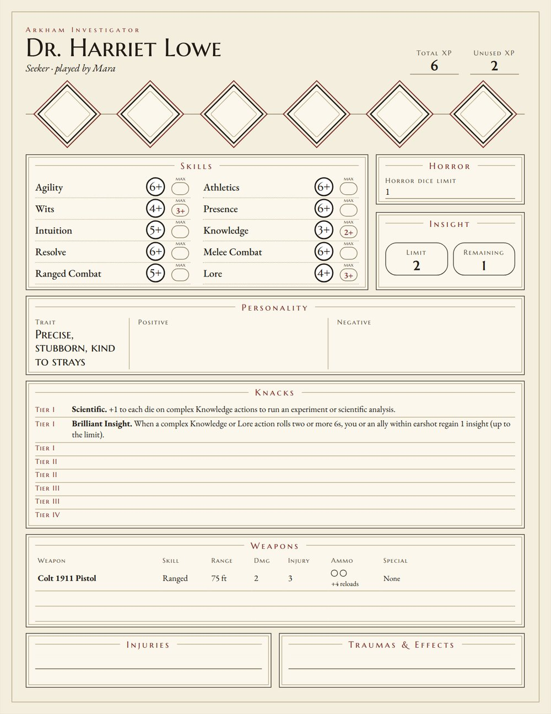
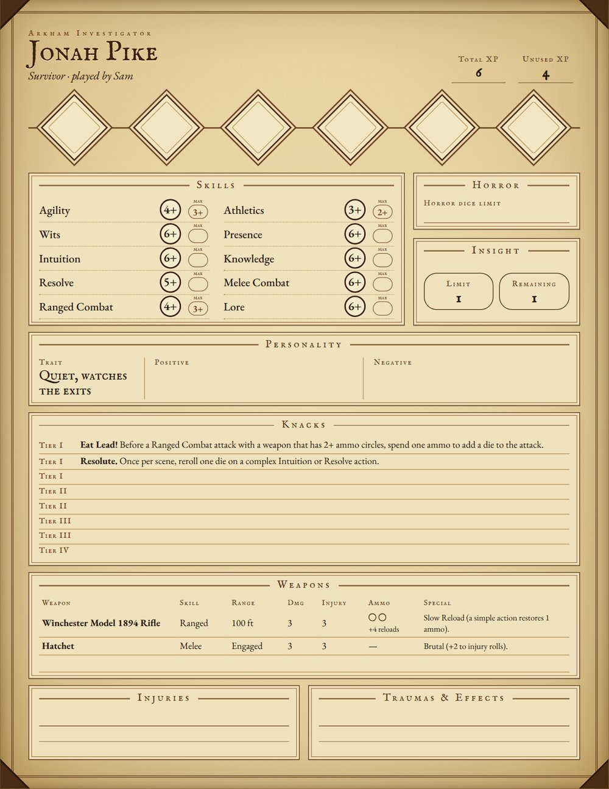
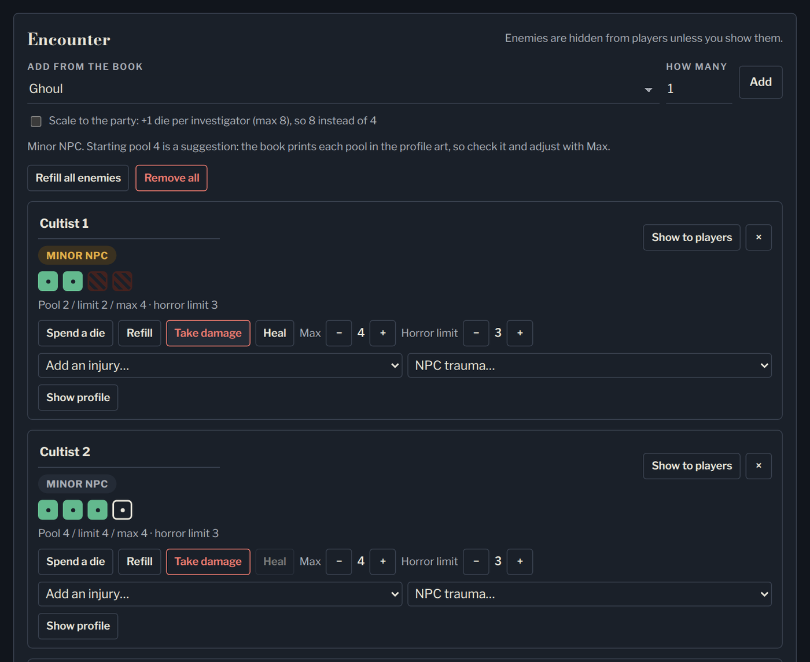
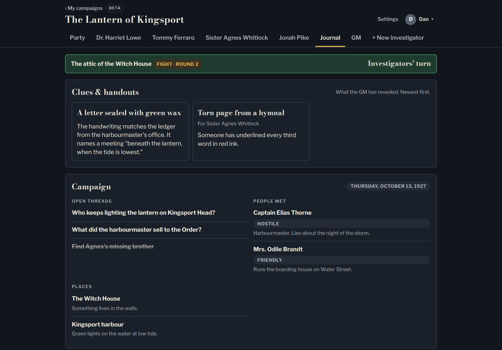
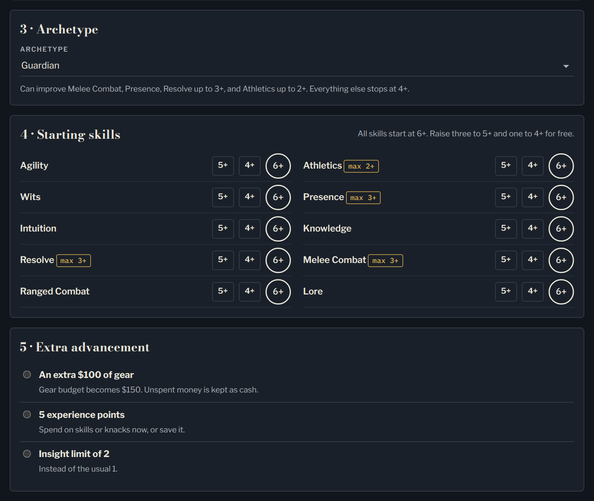

# Arkham Horror RPG Ledger

Live character sheets and campaign tools for the Arkham Horror Roleplaying Game, at **https://arkhamrpg.web.app**.

Sign in, start a campaign, invite your group, and everyone's investigator sheets stay in sync at the table. Or try it first with no account: the campaign is saved in your browser, and it moves to your account when you sign up. It's a free, unofficial fan project, not affiliated with or endorsed by Edge Studio (publisher of the Arkham Horror Roleplaying Game) or Fantasy Flight Games. You need the [Core Rulebook](https://store.asmodee.com/products/arkham-horror-rpg-core-rulebook) to play.

This repo is the code behind the live site. It isn't packaged for running your own copy; to play, just use the site.

## What it does

- **Live investigator sheets.** Dice pools, horror, insight, injuries and traumas, skills, knacks, weapons, gear, money and XP. Spend a die on your phone and the whole table sees it straight away.
- **Printable sheets.** Every investigator prints as a proper character sheet in two styles, Classic and Leather, on Letter, A4 or Legal paper.
- **Step-by-step character creation.** It follows the Core Rulebook's rules, with archetype limits, the gear budget and XP worked out as you go.
- **Tools for the GM.** A scene and turn tracker with surprise rounds, an encounter builder from the Core Rulebook's enemy profiles, and clues and handouts you reveal to everyone or one player. Also XP awards, session recaps, private notes and a hidden dice roller.
- **A shared Journal.** A picture gallery anyone in the campaign can add to, revealed clues, the campaign tracker (threads, people, places) and recaps of past sessions.
- **Scheduling.** A countdown to the next session, plus:
  - one-tap Add to calendar (Google, Apple, Outlook);
  - Directions and Food nearby;
  - a reminder the day before, by email and push notification.
- **Works anywhere.** Phones, tablets and computers. It can be installed like an app, and it's free with no ads.

<table>
<tr>
<td width="33%"></td>
<td width="33%"></td>
<td width="33%"></td>
</tr>
<tr>
<td align="center">Your sheet at the table</td>
<td align="center">Next session, one tap to your calendar</td>
<td align="center">All your campaigns</td>
</tr>
</table>

<table>
<tr>
<td width="50%"></td>
<td width="50%"></td>
</tr>
<tr>
<td align="center">Printable sheet: Classic</td>
<td align="center">Printable sheet: Leather</td>
</tr>
</table>

**For the GM:** track every enemy's pool, damage, injuries and traumas, and choose when players can see them.

**The Journal:** clues the GM has revealed (to everyone, or just to you), plus the open threads, people and places of the campaign.

**New investigator:** build a character step by step by the Core Rulebook's rules.

Screenshots use a made-up demo campaign.

---

## For players

### Getting started
**Just trying it?** The welcome screen has a sample campaign with an invented party you can click around in (nothing there is saved). To start your own, choose **Start a campaign, no account needed**. You get one campaign where you're the GM, saved only in that browser (nothing is sent anywhere). When you're ready, tap **Save to an account**, sign in or sign up, and the whole campaign is copied to your account and removed from the browser. If you're already signed in on that browser, **My campaigns** shows it with **Save to my account**, **Open** and **Delete**.

1. Go to **arkhamrpg.web.app** and sign in with Google or an email and password.
2. Pick a username. It's the name other players see. Your email is never shown to them.
3. Either **start a campaign** (the **+ New campaign** tile) or **join one** from an invite link or an email invite. Email invites arrive in your inbox and wait on your **My campaigns** page.
4. Optional: choose **Install app** in the menu under your icon to put the ledger on your home screen. It opens full-screen like an app. (On iPhone and iPad: Safari's **Share** button, then **Add to Home Screen**.)

### My campaigns
- Each campaign shows as a card with its picture, your role, the member count and a countdown to the next session.
- **Rearrange the cards:** press and hold one (or click and drag on a computer) and drop it where you want it. The order is saved to your account, so it's the same on every device.

### Roles in a campaign
- **Owner:** whoever started the campaign. Invites players, picks the GM, sets house rules and the campaign picture, and can remove members or delete the campaign. By default the owner plays by the same rules as everyone else; ticking **Let me edit every investigator** in Settings lets them change any sheet and delete Recent entries.
- **GM:** chosen by the owner (it can be the owner). Gets the **GM** tab. Only the GM can see GM notes, hidden enemies, hidden clues and the GM's activity log.
- **Player:** makes or claims one investigator and is the only one (besides the GM's session tools) who can change it.

### Inside a campaign
- **Party:** everyone's investigators at a glance. Tap one to open their sheet.
- **Investigator sheets:** dice pool, horror, injuries and traumas, insight, skills, knacks, weapons and gear, money, XP, and a **Recent** list of what changed. **Open printable sheet** gives a print-ready copy (Letter paper, background graphics on).
- **New investigator:** builds a character step by step following the Core Rulebook's creation rules. An unfinished character is kept on your device for that campaign for two weeks; **Start over** clears it.
- **Next session:** the owner (in Settings) or the GM (on the GM tab) sets the date and time, an optional length (1 to 8 hours), and the place, with Google address suggestions. Everyone sees a countdown on the campaign card and at the top of the Party tab.
  - **Add to calendar:** Google Calendar, Apple Calendar (iPhone or Mac), Outlook, or a downloaded `.ics` file. Events are called "*campaign* — Arkham Horror RPG" and last the chosen length (4 hours if none is set).
  - **Tapping an address** offers **Directions** and **Food nearby** in Google Maps.
  - **Reminders:** members get an email (and a notification, if they've turned those on) the day before.
- **Journal:** clues and handouts the GM has revealed, enemies the GM is showing, the campaign tracker (date, threads, people, places) and **Past sessions**: a recap of each finished session, with the GM's optional summary on top.
- **GM tab (GM only):** next session, scene and turn tracker with surprise rounds, encounter builder from the Core Rulebook's enemy profiles, clues and handouts (to everyone or one player), campaign tracker, end-of-session XP and momentous sessions, session recaps, GM notes and a hidden dice roller.

### Your account
Click your icon at the top right:
- **Your account:** upload a profile photo or pick a colour for your initial; **Reminders & notifications**; and **Delete my account** (removes your username, profile and sign-in, deletes campaigns you own and takes you out of the rest).
- **Reminders & notifications:** turn the day-before reminder on or off, turn on notifications for the device you're using (with a **Send a test** button), and choose whether to be notified when the GM reveals a clue to you or when it's the investigators' turn in a fight. On iPhone and iPad, notifications work in the installed app (iOS 16.4 or later). Tapping a clue notification opens that clue in the Journal.
- **Install app**, **Send feedback** (bug, idea or other, straight to the site owner) and **Sign out**.

Knack names and tiers follow each archetype's table in the Core Rulebook. Each knack's effect is a short summary of the book's rules in our own words, and can be edited on the sheet.

---

## For the site owner

### How it's hosted
- **Firebase Hosting** serves the site at arkhamrpg.web.app. **Firestore** holds the data, **Cloud Storage** holds pictures, **Firebase Authentication** handles sign-in (Google and email/password), **Cloud Functions** send email and notifications, and **App Check** with reCAPTCHA Enterprise blocks bots.
- The project is on Firebase's **Blaze** (pay-as-you-go) plan: the free allowances still apply and only use above them is charged (see *Costs and limits*). It started with a $300, 90-day Google Cloud free trial; confirm the paid account when Google emails about the trial ending, or billing stops and the free limits apply again.
- **Every push to `main` deploys automatically** through `.github/workflows/deploy-firebase.yml`, in three jobs:
  - **deploy:** the site to Firebase Hosting.
  - **rules:** `firestore.rules`.
  - **backend:** `storage.rules` and the server functions in `functions/`. If it fails, the end of its log appears in the run's annotations.
  If a job fails, what was there before stays in place.
- The GitHub secret `FIREBASE_SERVICE_ACCOUNT` holds the **github-deploy** service account. Its roles are Firebase Hosting Admin, API Keys Viewer, Firebase Rules Admin, Service Usage Consumer, Cloud Datastore Viewer, Cloud Functions Admin, Service Account User, Cloud Scheduler Admin, Secret Manager Admin, Service Usage Admin, Artifact Registry Administrator and Eventarc Admin.
- Google's own service accounts also need a few roles, set up once:
  - the Storage service agent: **Firebase Rules Firestore Service Agent**, so `storage.rules` can check campaign membership;
  - the Pub/Sub service agent: **Service Account Token Creator**;
  - the default compute account: **Cloud Run Invoker** and **Eventarc Event Receiver**.
- Pages and scripts are served with `Cache-Control: no-cache` (see `firebase.json`), so players get changes on their next reload.
- The version number (bumped with every change) is in each page's footer and at the bottom of the account menu.

### Admin page
`admin.html` lists every user and campaign with search and totals (users, active this week, campaigns, suspended). An admin can:
- **Suspend** an account: it can still sign in and look, but the database refuses every change it makes, and it's taken out of campaigns it joined. Campaigns it owns stay so their players keep their sheets. **Unsuspend** lifts it (they'll need new invites).
- **Change username**, for example to replace an offensive one.
- **Delete account**: removes someone for good, the same as their own **Delete my account**: sign-in, profile, username (freed up), settings, devices, campaigns they own (with everything in them and their pictures), invites they sent or were waiting on, and their place in other campaigns (investigators they played stay). It runs on the server (`adminDeleteUser`), which checks you're an admin and won't delete you or another admin. To keep someone out instead, **Suspend** them.
- **Delete** any campaign, including its hidden GM material and pictures.
- **Feedback** tab: messages people send with **Send feedback** (bug, idea or other, with the page, browser and version). Mark each one **Done** to clear it.
- **Errors** tab: unexpected errors people hit while signed in (message, page, browser, version, who), recorded automatically by `js/config.js` (at most a few per visit). Errors from code the browser injects (crypto wallets, in-app browsers) are ignored. Clear them once dealt with.

Admins are accounts with a document in the `admins` collection in Firestore whose ID is their user ID (Firebase → Authentication → Users → **User UID**); it needs no fields. Changing someone's email address is done in Firebase → Authentication.

### Server functions (`functions/index.js`)
| Function | What it does |
|---|---|
| **inviteEmail** | When an owner invites someone by email, emails them about it (at most 30 a day per inviter; only if the inviter owns the campaign). |
| **sessionReminders** | Runs hourly. For campaigns whose next session is within 24 hours, emails each member once (in their own time zone) and sends a notification to their devices. Skips people who turned reminders off. |
| **calendar** | Serves `arkhamrpg.web.app/cal/<campaign id>.ics` (via a Hosting rewrite), the next session as a calendar event, so iPhones and Macs open it straight in Calendar. |
| **clueAlert** | When the GM reveals a clue, notifies the player it's for, or every player if it's for everyone. The notification opens the clue in the Journal. |
| **turnAlert** | In a fight, when play passes to the investigators, notifies players who turned that on (off by default). |
| **adminDeleteUser** | Called from the admin page's **Delete account** button. Checks the caller is an admin, then removes the account and everything that goes with it (see *Admin page*). |
| **contactEmail** | When someone sends the **Contact** form (anyone, signed in or not), emails it to `CONTACT_TO` (in `functions/.env`) with Reply going to their address. Nothing is ever sent to the address they typed. At most 50 a day overall and 5 a day per address are emailed; extras stay in the `contact` collection. |

### Email
Mail goes out from **arkhamrpgledger@gmail.com** (set in `functions/.env`) through Gmail, using an app password stored in Google Cloud **Secret Manager** as `GMAIL_APP_PASSWORD`; it's never in this repo. To change it, add a new version of that secret and re-run the deploy. New Gmail accounts can land in spam at first; it improves as people mark the mail "Not spam". If it doesn't, the fix is a custom domain with a sending service (see `BACKLOG.md`).

### Push notifications
- Devices that turn on notifications save their push token in `devices/<token>` (with the owner's uid). The functions above send to those tokens with Firebase Cloud Messaging and delete tokens that no longer work.
- `firebase-messaging-sw.js` (served at the site root) shows each notification and opens its link when tapped. It doesn't cache pages. It has its own copy of the Firebase settings because workers can't load `js/config.js`.
- The Web Push public key is `window.PUSH_KEY` in `js/config.js` (Firebase → Project settings → Cloud Messaging → Web Push certificates). With it empty, the notification switch is hidden.
- What each person wants is in their private `prefs/<uid>` document: `noRemind`, `noCluePush`, `pushTurns`, their time zone `tz`, and `campOrder` (their order of campaign cards).

### Pictures
Portraits, profile and campaign photos, and handouts are uploaded to Cloud Storage by `js/upload.js`, and the database stores their links. Files go under `users/<uid>/` or `campaigns/<cid>/<uid>/`; `storage.rules` decides who may add or delete them. If an upload fails, the picture is saved inline in the database instead, so older inline pictures keep working too. Deleting a campaign or an account removes its pictures.

### Address suggestions
The "Where" boxes use Google's Places API (New) with the key in `window.PLACES_KEY` in `js/config.js`. In Google Cloud it's limited to arkhamrpg.web.app and to that one API. Google doesn't allow a daily cap on this account, so watch the budget alert.

### Installable app
`manifest.webmanifest` with `icon-192.png`, `icon-512.png` and `icon-maskable-512.png` (padded for Android's round masks), plus `apple-touch-icon.png` for iPhone. The account menu's **Install app** uses the browser's install prompt where there is one, and shows Add to Home Screen steps on iPhone and iPad.

### Bot protection (App Check)
The reCAPTCHA Enterprise site key is in `window.APP_CHECK_KEY` in `js/config.js`, and the web app is registered with it in Firebase → **Security → App Check** (Google now calls it Fraud Defense). It's **enforced for Cloud Firestore and Authentication**. Cloud Storage isn't enforced yet (see `BACKLOG.md`). If pages stop loading data after enforcing something, turn enforcement off there again. The token lifetime is 7 days. The key's allowed domains (Google Cloud → reCAPTCHA) must include every address the site is served from.

### Costs and limits
At beta size everything should cost $0 to a few cents a month.
- **Firestore:** about 50,000 reads and 20,000 writes a day free; a busy session with five people uses a few thousand reads. Above that it's a few cents per 100,000 reads.
- **Cloud Functions, Cloud Scheduler, Secret Manager, Cloud Messaging, Hosting, Authentication:** well inside their free amounts. Push notifications are free.
- **Cloud Storage:** the bucket is in US-EAST1 (no-cost location), so 5 GB and 100 GB of downloads a month are free.
- **Places API:** 10,000 address lookups a month free, then about $2.83 per 1,000.
- **reCAPTCHA Enterprise:** 10,000 checks a month free; with 7-day tokens each device uses about one a week.
- **Backups:** Firestore makes a daily backup, kept 14 days (Firestore → Disaster Recovery). That's a fraction of a cent a month at this size. A restore creates a new database from a backup, from which data can be copied back. Pictures in Storage aren't included.
- **Function images:** Artifact Registry keeps the packaged functions; old images are deleted after a day. It costs at most a few cents.
- Spending and the budget alert are under Firebase → **Usage and billing → Account & budgets**. Budget alerts only email; they don't stop charges.
- If billing ever lapses, the free limits apply again and every page shows a banner when the daily limit is hit; nothing is lost.

### Privacy
`privacy.html` is linked from every page's footer and the sign-in screen. Update its date and text whenever what the site stores changes. It currently covers:
- account and username, profile photo or colour, and roughly when people last visited;
- campaign data and pictures in Cloud Storage, and invites by email;
- emails from the Gmail account, time zone and reminder settings;
- notification device addresses, calendar links and Google Places address suggestions;
- feedback, Contact form messages and error reports;
- the no-account campaign, which stays in the browser;
- Firebase/Google as the host, and reCAPTCHA.

### Backlog
`BACKLOG.md` lists what's planned next and what's been done to the project's settings.

### The original ledger
`old/` (arkhamrpg.web.app/old) is the first single-party version with passcodes, a master key and a GM PIN, kept unchanged for reference. Its data is separate from the campaigns. `beta/` only forwards old links (including old invite links) to the main site.

---

## Code layout
- `index.html`: home page (sign-in, My campaigns, New campaign, campaign Settings, Your account). Script: `js/home.js`.
- `play.html?c=<campaign id>`: the ledger for one campaign (`#clue-<id>` opens the Journal at that clue). Scripts in `js/ledger/`, loaded in order:
  1. `1-state.js`: campaign, roles, saving and the local cache
  2. `2-rules.js`: game rules (dice pools, XP costs, gear)
  3. `3-render.js`: drawing the party, sheets, next-session bar and Journal
  4. `4-creator.js`: the New investigator creator
  5. `5-events.js`: buttons and form edits
  6. `6-gm.js`: GM tools, activity log, session recaps and opening clues from links
  7. `6b-gallery.js`: the campaign's picture gallery (in the Journal)
  8. `7-boot.js`: connecting to Firebase and starting up
- `admin.html` with `js/admin.js` and `css/admin.css`: the admin page.
- `privacy.html`: the privacy policy. `help.html`: the **How it works** page for players (linked in every footer and from the sign-in screen); keep it in step with new features.
- `js/config.js`: Firebase settings, the App Check, Places and Web Push keys, the daily-limit banner and the error reporter.
- `js/avatar.js`: shared helpers used on every page:
  - the account icon and menu;
  - Send feedback and Install app;
  - next-session formatting, countdowns, calendar links and the address menu;
  - Google address suggestions.
- `js/localdb.js`: the no-account campaign. A small stand-in for Firebase (sign-in and Firestore) that keeps everything in the browser's `localStorage` (`apl-local-v1`), so the ledger runs unchanged at `play.html?c=onthisdevice`. `js/home.js` (`migrateLocal`) copies it into a real campaign when the person signs in.
- `js/demo.js`: the sample party shown on the welcome page (`play.html?c=samplecampaign&embed=1` in a frame). It runs on the same in-browser store but is never saved, and its times are moved forward on load so it always looks current.
- `js/upload.js`: picture uploads to Cloud Storage. `js/cropper.js`: the drag-and-zoom picture positioner for portraits, profile photos and campaign pictures.
- `js/catalog.js`: archetypes, knacks, weapons and gear from the Core Rulebook. `js/npcs.js`: enemy profiles (offered only to the GM of a campaign saved to an account; not in the sample or no-account campaign, and players never see them). `js/house-rules.js`: the suggested house rules. `js/picker.js`: searchable dropdowns.
- `css/app.css`: shared styles. `css/home.css`: home and Settings extras.
- `firestore.rules`: who can read and write what in the database. `storage.rules`: who can add or delete pictures. The pages hide things people can't do, but these rules are what actually enforce it.
- `functions/`: the server functions (`index.js`, `package.json`, `.env`).
- `firebase-messaging-sw.js`: the notification worker. `manifest.webmanifest` and the `icon-*.png` files: the installable app.
- `firebase.json`: Hosting settings (caching headers, the `/cal/**` rewrite), plus where the rules and functions live.
- `docs/screenshots/`: the README pictures, taken from a made-up demo campaign. They aren't published on the site.

The Firebase web settings and the keys in `js/config.js` are meant to be public. They only identify the project and are limited to this site; the rules decide what anyone can do. Secrets (the Gmail app password) live only in Secret Manager.

Don't copy text from the Core Rulebook into the code; game text here is summarized in our own words.

---

## About the game content

Arkham Horror RPG Ledger is an unofficial fan project. It isn't affiliated with or endorsed by Edge Studio, which publishes the Arkham Horror Roleplaying Game, or Fantasy Flight Games. Arkham Horror is a trademark of Fantasy Flight Games.

- **You need the [Core Rulebook](https://store.asmodee.com/products/arkham-horror-rpg-core-rulebook) to play.** The site tracks a game in progress; it doesn't teach or replace the rules.
- **Game text is paraphrased.** Knack effects, gear notes, enemy profiles and the printable sheet's reminders are short summaries in our own words, not the book's text. Names and numbers appear only so sheets can track them.
- **Original design.** The printable sheet follows the same fields as the official one so players feel at home, but its artwork and styling are our own, and the site uses only public-domain art. No artwork or logos from the books are reproduced.
- **Publishers:** if you'd like anything changed or removed, email maniac78@gmail.com and it will be handled promptly.
